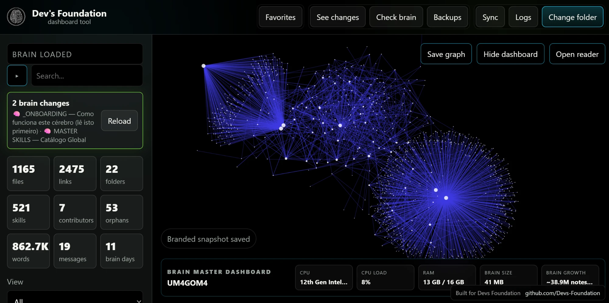
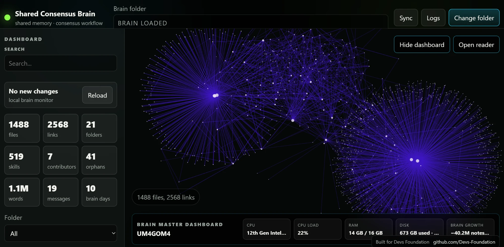

> 🌐 [English](README.md) · **Português** · [Español](README.es.md) · [Français](README.fr.md) · [Deutsch](README.de.md) · [中文](README.zh.md)

# Shared Consensus Brain

*Também conhecido como **Cerebro Vivo**.*

Uma janela **100% local** sobre um "cérebro" Markdown/git: um grafo vivo que pode pesquisar, ler, **criar**, editar, **marcar como favorito** e sincronizar — com backups automáticos, **validação do cérebro**, métricas reais e estatísticas da máquina. É uma **ferramenta de administração e demonstração**, não um substituto do seu editor do dia a dia.

> **Parte do [Dev's Foundation](https://github.com/Devs-Foundation).** O "cérebro" é a memória partilhada por trás do **[multi-agent consensus method](https://github.com/Devs-Foundation/multi-agent-consensus-method)**. Esta aplicação é um *visualizador* dessa memória — **precisa de um cérebro (uma pasta de notas Markdown) para funcionar.**

> ▶️ **Corre 100% local** — abra http://127.0.0.1:8787 no seu navegador (duplo clique em `abrir-cerebro-vivo.bat` no Windows, ou execute `node server.js`).

<p align="center"></p>

<p align="center"></p>

---

## Visão geral

Um "cérebro" é apenas uma pasta de notas Markdown ligadas por `[[wikilinks]]`. O Shared Consensus Brain transforma essa pasta em:

- um **grafo vivo** — cada nota é um nó, cada link resolvido é uma aresta;
- uma **pesquisa + leitor + editor** — encontre uma nota, abra-a, corrija-a, grave-a (com backup primeiro);
- um **dashboard ao vivo** — métricas reais medidas a partir do cérebro carregado, além de estatísticas sobre a máquina que o aloja.

Tudo corre no seu próprio computador. Nada é enviado para lado nenhum.

## Segurança e privacidade (leia primeiro)

A aplicação pode **ler e escrever em todo o seu vault**, por isso é tratada como uma superfície sensível:

- **Apenas local.** O servidor liga-se a `127.0.0.1` (loopback) — nunca a `0.0.0.0`, nunca a uma porta pública.
- **Nunca exposta.** **Não** coloque esta aplicação numa VPS, num domínio público, ou em qualquer interface web aberta. Se alguma vez for necessária uma versão pública, tem de ser uma **exportação estática, só de leitura e filtrada** — nunca a aplicação ao vivo.
- **Sem dados privados no código.** Não há caminhos reais de máquinas, nomes de utilizador, IPs, tokens, palavras-passe ou nomes de pastas privadas fixados em lado nenhum. A pasta do cérebro é escolhida pelo utilizador em tempo de execução.
- **Portátil.** Não está construída à volta de uma máquina ou pasta específica — aponte-a para o seu próprio cérebro. Depois de um cérebro carregar, a interface simplesmente lê `BRAIN LOADED`.

## Requisitos

- **[Node.js](https://nodejs.org)** — sem outras dependências obrigatórias.
- Uma pasta de notas Markdown (opcionalmente um repositório git — isso desbloqueia *contributors* e *brain days*).

## Como começar

### Windows (modo janela de aplicação, recomendado)

Faça duplo clique em **`abrir-cerebro-vivo.bat`**. Inicia o servidor local e abre a aplicação como uma janela estilo desktop (Edge / Chrome / Brave em modo `--app`).

### Qualquer SO (modo manual)

```bash
cd <workspace>/cerebro-vivo
node server.js
```

Depois abra **http://127.0.0.1:8787** no seu navegador.

A porta pode ser alterada com a variável de ambiente `PORT`. O anfitrião é sempre `127.0.0.1`.

## Escolher a pasta do cérebro (primeira execução)

A aplicação arranca **sem nenhum cérebro carregado** e pede um:

1. Digite ou cole o caminho da sua **Brain folder** na barra superior.
2. Clique em **Load brain**.
3. A escolha é guardada apenas no armazenamento local do navegador dessa máquina — nunca é submetida (commit), nunca é enviada.
4. Para mudar de cérebro, altere o caminho e carregue novamente.

Use caminhos de exemplo genéricos em qualquer documentação, nunca reais:

```text
<workspace>/cerebro-vivo
/home/user/example-brain
C:\example\user\example-brain
```

Ao indexar, estas pastas são ignoradas: `.git`, `.obsidian`, `node_modules`, `_BACKUPS`, `.trash`, `.cache`.

## Usar a aplicação

### Grafo

- Os nós são ficheiros `.md`; as arestas são links **resolvidos** (`[[wikilinks]]`, `[[file|alias]]`, e links Markdown para `.md`). Links quebrados **não** são desenhados.
- **Arraste** o espaço vazio para deslocar (pan) · **scroll** para ampliar/reduzir · **arraste um nó** para o mover · **duplo clique** para ajustar o grafo todo ao ecrã.
- **Show titles** alterna as etiquetas · os sliders **Motion** e **Node size** ajustam o aspeto · **Background / Nodes / Links** definem as cores. Nada disto toca nos seus ficheiros. As etiquetas dos nós aparecem como texto normal e legível (nunca esticadas).
- **Hide dashboard** e **Open reader** dão-lhe um grafo limpo, em ecrã total.
- **Save graph** — exporta a vista atual como PNG com marca (marca de água Dev's Foundation + um painel com as métricas ao vivo: files, links, folders, skills, contributors, orphans, words, messages, brain days, Brain size). Botão direito no canvas para uma imagem simples.
- Um **monitor local** ("No new changes" / "N brain changes" + **Reload**) vigia a pasta e permite reindexar quando os ficheiros mudam no disco.

### Pesquisa

Digite em **Search** para filtrar por título, pasta e conteúdo da nota. Os resultados são clicáveis e saltam diretamente para a nota.

### Leitor e editor

- **Clique num nó** (ou em **Open reader**) para abrir uma nota no separador **Read**.
- Mude para o separador **Edit**, faça alterações, e clique em **Save**.
- **Close reader** devolve-o ao grafo.
- Só podem ser abertos ou escritos ficheiros `.md` dentro do cérebro carregado (path-traversal é bloqueado).

### Nova nota

Crie uma nota diretamente do editor — o separador **New note** deixa-a nomear, escolher a pasta de destino, e abre-a de imediato no editor, para que uma nota nova nunca fique "perdida" num sítio que não consegue encontrar. Nomes duplicados são evitados.

### Favoritos

Marque qualquer nota com uma estrela para a assinalar como favorita (a estrela muda de estado de imediato). O separador **Favorites** lista tudo o que marcou, para acesso num clique. Os favoritos são guardados num pequeno ficheiro local da aplicação — **não** alteram as suas notas Markdown.

### Explorador de ficheiros

Um explorador de ficheiros local permite percorrer as pastas do cérebro em árvore e abrir qualquer ficheiro `.md` diretamente — útil em cérebros grandes onde só o grafo já é muito para percorrer.

## Backups

Antes de **cada** gravação, o ficheiro original é copiado primeiro, e só depois o novo conteúdo é escrito. Os backups vivem **dentro da pasta do cérebro**:

```text
_BACKUPS/cerebro-vivo/<YYYY-MM-DDTHH-MM-SS>/<flattened-path>.md
```

Para reverter uma edição, copie o backup de volta sobre a nota. `_BACKUPS/` é ignorado pelo indexador e deve ser excluído ao empacotar.

O botão **Backups** abre um pequeno gestor onde pode **criar** um backup completo a pedido, **ver** os backups que já tem (com data e tamanho), e **apagar** os que já não precisa — a eliminação é confirmada e fica dentro da pasta de backups.

## Logs

A atividade local é acrescentada a:

```text
logs/events.jsonl
```

Os eventos incluem indexação do grafo, ficheiro aberto, ficheiro gravado (com o caminho do backup), e início/fim/falha de sincronização manual. Abra a janela **Logs** para os ver, e use **Clear logs** para reiniciar. Os logs são locais; nunca devem conter segredos ou caminhos privados absolutos que possam ser partilhados.

## Sincronização (Git)

O botão **Sync** executa o Git **apenas quando o pressiona**, na pasta do cérebro carregado:

1. `git pull --rebase origin master`
2. `git status --porcelain`
3. se houver alterações → `git add -A`, `git commit`, `git push origin master`
4. o último commit e cada passo são mostrados na janela **Logs**

Use-o apenas quando a pasta carregada for um clone git válido com o remote correto. Nunca sincroniza silenciosamente, e nunca esconde erros.

## Ferramentas de manutenção

Além de **Sync** e **Logs**, a barra tem:

- **See changes** — mostra o `git diff` atual do cérebro carregado, para rever exatamente o que mudou antes de sincronizar.
- **Check brain** — um relatório de saúde do cérebro carregado: links quebrados, órfãos, títulos duplicados, nomes de nota duplicados e frontmatter malformado. É a forma mais rápida de detetar dados que precisam de limpeza.
- **Backups** — o gestor de backups a pedido descrito acima.

Todas correm **localmente e a pedido**, e reportam o resultado na janela **Logs**.

## Fiabilidade — a camada anti-susto

Cada botão lê, escreve, apaga, faz backup, sincroniza ou abre ficheiros — por isso a aplicação foi construída para que **nada falhe em silêncio, nada crie lixo, e nenhum erro despeje texto cru no ecrã**:

- As respostas nunca são assumidas como JSON perfeito. Se uma ação devolver texto simples ou um erro inesperado, torna-se uma **mensagem limpa e legível** em vez de um `Unexpected token …` cru.
- O carregamento do cérebro está **protegido** para que um caminho errado ou um pedido falhado nunca deixe a interface presa.
- As ações de escrita (gravar, apagar, nova nota, favorito) e as ferramentas de manutenção (Check, Backups, Sync, Logs) têm cada uma **tratamento de erro dedicado** — quando algo falha, a falha aparece **de forma legível nos Logs** em vez de contaminar o estado do grafo.
- O indexador **ignora backups e lixo técnico** (`.git`, `_BACKUPS`, `.archive`, `node_modules`, …) para que nunca poluam o grafo nem as contagens.
- O caminho privado do seu computador **nunca é impresso** em logs, screenshots ou documentação.

## Métricas

Cada número é **medido a partir do cérebro carregado — nada é fixado no código**. Um cartão mostra `n/a` apenas quando um valor genuinamente não pode ser calculado.

| Cartão | Significado | Como é medido |
|---|---|---|
| **Files** | notas Markdown | contagem de ficheiros `.md` indexados |
| **Links** | ligações no grafo | `[[wikilinks]]` / links Markdown resolvidos |
| **Folders** | estrutura | pastas que contêm Markdown |
| **Skills** | unidades de conhecimento reutilizáveis | **contadas em tempo real**: ficheiros `SKILL.md` sob `_CONHECIMENTO/skills`, **mais** o total externo do `browse.sh` lido a partir de `MASTER_SKILLS.md` — pelo que uma skill nova é captada mesmo antes de o índice ser regenerado |
| **Contributors** | quem escreve o cérebro | **autores únicos do histórico git** (`git log`); `n/a` se a pasta não for um repositório git. Isto mede autores de commits, não quem fez push — nunca um número fixo |
| **Orphans** | notas isoladas | nós com grau 0 (sem link resolvido de entrada ou saída) |
| **Words** | volume de conhecimento | soma real de palavras em todas as notas (frontmatter e blocos de código excluídos) |
| **Messages** | atividade da caixa de correio | mensagens `.md` numa pasta `_CORREIO`, se existir; caso contrário `n/a` |
| **Brain days** | há quanto tempo existe o cérebro | dias desde o primeiro commit git; `n/a` se não for um repositório git |

### Brain Master Dashboard

Um painel com estatísticas sobre a **máquina que aloja o cérebro** (modelo e núcleos do CPU, carga do CPU, RAM), mais o **Brain size** e uma estimativa de **crescimento do cérebro**.

O **Brain size** é o peso total da **pasta do cérebro carregada** — a soma dos ficheiros dentro desse vault, medida recursivamente no servidor e em cache por ~60 s. **Não** é o espaço em disco do computador inteiro, e mostra `n/a` quando não há pasta carregada.

O valor de **crescimento do cérebro** é uma estimativa aproximada baseada no tamanho médio das notas — **local e informativa**, **não** uma promessa de armazenamento infinito. Memória persistente e expansível vem do disco e do git, não de magia.

## Empacotamento

Para partilhar a aplicação sem vazar nada:

1. Copie **apenas os ficheiros da aplicação** para uma pasta limpa (`server.js`, `public/`, `abrir-cerebro-vivo.bat`, `README.md`).
2. **Exclua** `logs/`, `_BACKUPS/`, `backups/`, `node_modules/`, qualquer configuração local, e tudo o que contenha um caminho real de máquina.
3. Verifique que não há caminhos privados ou segredos, por exemplo:

   ```powershell
   Select-String -Path <folder> -Pattern "C:\\Users|/home/<real-user>|token|password|secret" -Recurse
   ```

4. Compacte em zip e liste o conteúdo para confirmar.

## Resolução de problemas

- **Porta já em uso** — outra instância está a correr, ou defina uma porta diferente: `PORT=8788 node server.js`.
- **Interface parece desatualizada depois de uma atualização** — force a atualização da página (hard-refresh); o HTML usa uma versão anti-cache (`?v=`) que muda quando o CSS/JS muda.
- **Contributors / Brain days mostram `n/a`** — a pasta do cérebro não é um repositório git (esperado).
- **Messages mostra `n/a`** — não existe pasta `_CORREIO` no cérebro (esperado).
- **Nada é indexado** — verifique o caminho da Brain folder e que contém ficheiros `.md`.
- **Erros de sincronização** — abra a janela **Logs**; cada passo e erro do git é mostrado lá, nunca escondido.

---

<sub><b>N models. N devices. One brain.</b> · Built for <b>Dev's Foundation</b> · <a href="https://github.com/Devs-Foundation">github.com/Devs-Foundation</a></sub>
